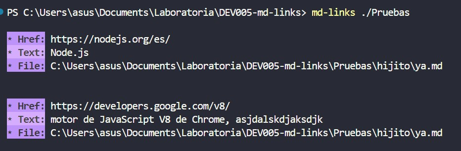
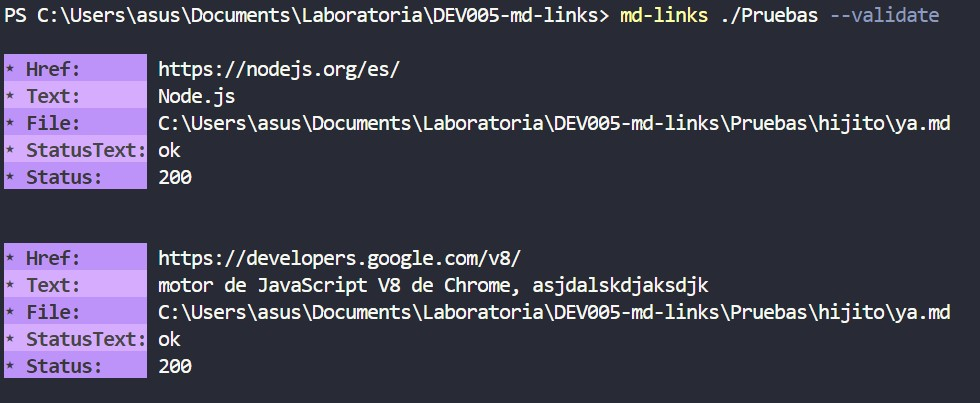
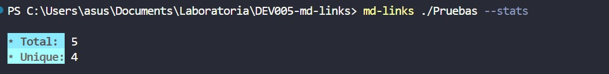
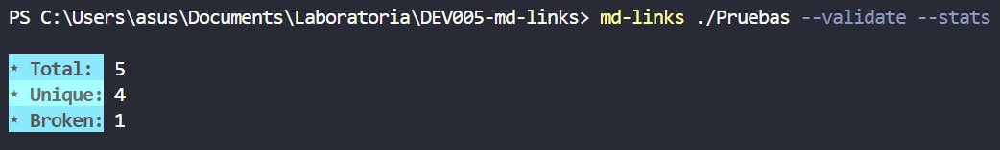
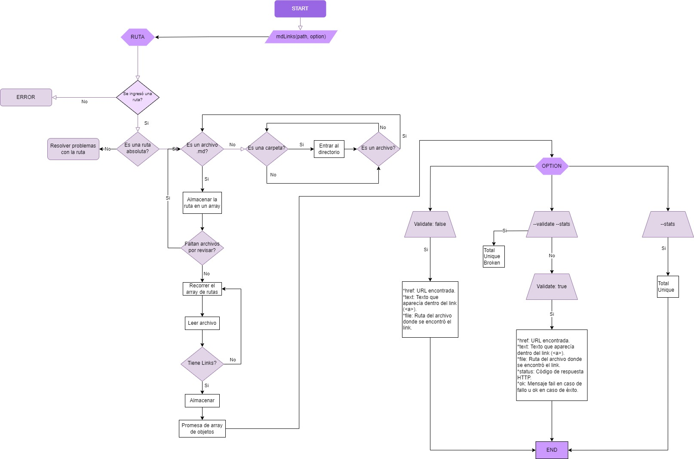

# md-Links

## Índice

* [1. Preámbulo](#1-preámbulo)
* [2. md-Links](#2-md-Links)
* [3. Instalación](#3-instalación)
* [4. Opciones de uso](#4-opciones-de-uso)
* [5. Consideraciones](#5-consideraciones)
* [6. Plan de acción para el desarrollo](#6-plan-de-acción-para-el-desarrollo)
* [7. Checklist](#7-checklist)

***

## 1. Preámbulo

[Markdown](https://es.wikipedia.org/wiki/Markdown) es un lenguaje de marcado
ligero muy popular entre developers. Es usado en muchísimas plataformas que
manejan texto plano (GitHub, foros, blogs, ...) y es muy común
encontrar varios archivos en ese formato en cualquier tipo de repositorio
(empezando por el tradicional `README.md`).

## 2. md-Links

`md-Links`, es una librería que te permite extraer los _links_ de tus archivos 
Markdown, detectar cuáles ya no son válidos y reportar algunas estadísticas.

## 3. Instalación

.

## 4. Opciones de uso

Se ejecuta en la terminal de la siguiente manera:

### Uso 1

`md-links <path-to-file-or-directory>`

Los valores retornados son:
* `href`: URL encontrada.
* `text`: Texto que aparecía dentro del link.
* `file`: Ruta del archivo donde se encontró el link.

Ejemplo: 

### Uso 2

`md-links <path-to-file-or-directory> --validate`

Los valores retornados son:
* `href`: URL encontrada.
* `text`: Texto que aparecía dentro del link.
* `file`: Ruta del archivo donde se encontró el link.
* `status`: Código de respuesta HTTP.
* `statusText`: Mensaje `fail` en caso de fallo u `ok` en caso de éxito.

Ejemplo: 

### Uso 3

`md-links <path-to-file-or-directory> --stats`

Los valores retornados son:
* `total`: Número de links encontrados.
* `unique`: Número de links que no se repiten.

Ejemplo: 

### Uso 4

`md-links <path-to-file-or-directory> --stats --validate`
||
`md-links <path-to-file-or-directory> --validate --stats`

Los valores retornados son:
* `total`: Número de links encontrados.
* `unique`: Número de links que no se repiten.
* `broken`: Número de links que no son válidos.

Ejemplo: 

## 5. Consideraciones

* Se usaron librerías externas como: [Colors](https://www.npmjs.com/package/colors) y [Axios](https://www.npmjs.com/package/axios).
* El color por defecto en la consola no es morado, es azul, si deseas
  el mismo visual de los ejemplos, usa el tema `Dracula` en tu Visual
  Studio Code.
* Si tu sistema operativo es Windows, te sugiero que trabajes con la 
  consola `Windows PowerShell`.

## 6. Plan de acción para el desarrollo

Antes de comenzar, organicé las primeras tareas en [GitHub-projects](https://github.com/users/IndiraPe/projects/4/views/1), que engloba al desarrollo del diagrama de flujo, organización del boilerplate e instalación de las dependencias.

### Diagrama de flujo

Teniendo el diagrama de flujo plasmado, procedí a organizarlo en pequeñas tareas, dividiendo el camino entre dos Milestones: `Path`(para el trabajo de las rutas y extracción de links) y `Option` (para el trabajo de las opciones disponibles para el usuario y sus validaciones).

## 7. Checklist

### General

* [ ] Puede instalarse via `npm install --global <github-user>/md-links`

### `README.md`

* [ ] Un board con el backlog para la implementación de la librería.
* [ ] Documentación técnica de la librería.
* [ ] Guía de uso e instalación de la librería

### API `mdLinks(path, opts)`

* [:ballot_box_with_check:] El módulo exporta una función con la interfaz (API) esperada.
* [:ballot_box_with_check:] Implementa soporte para archivo individual
* [:ballot_box_with_check:] Implementa soporte para directorios
* [:ballot_box_with_check:] Implementa `options.validate`

### CLI

* [:ballot_box_with_check:] Expone ejecutable `md-links` en el path (configurado en `package.json`)
* [ ] Se ejecuta sin errores / output esperado
* [:ballot_box_with_check:] Implementa `--validate`
* [:ballot_box_with_check:] Implementa `--stats`

### Pruebas / tests

* [:ballot_box_with_check:] Pruebas unitarias cubren un mínimo del 70% de statements, functions,
  lines, y branches.
* [:ballot_box_with_check:] Pasa tests (y linters) (`npm test`).
